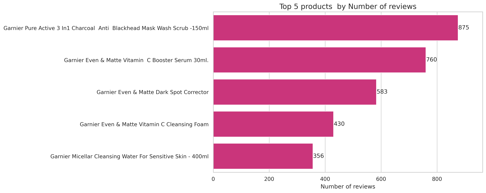
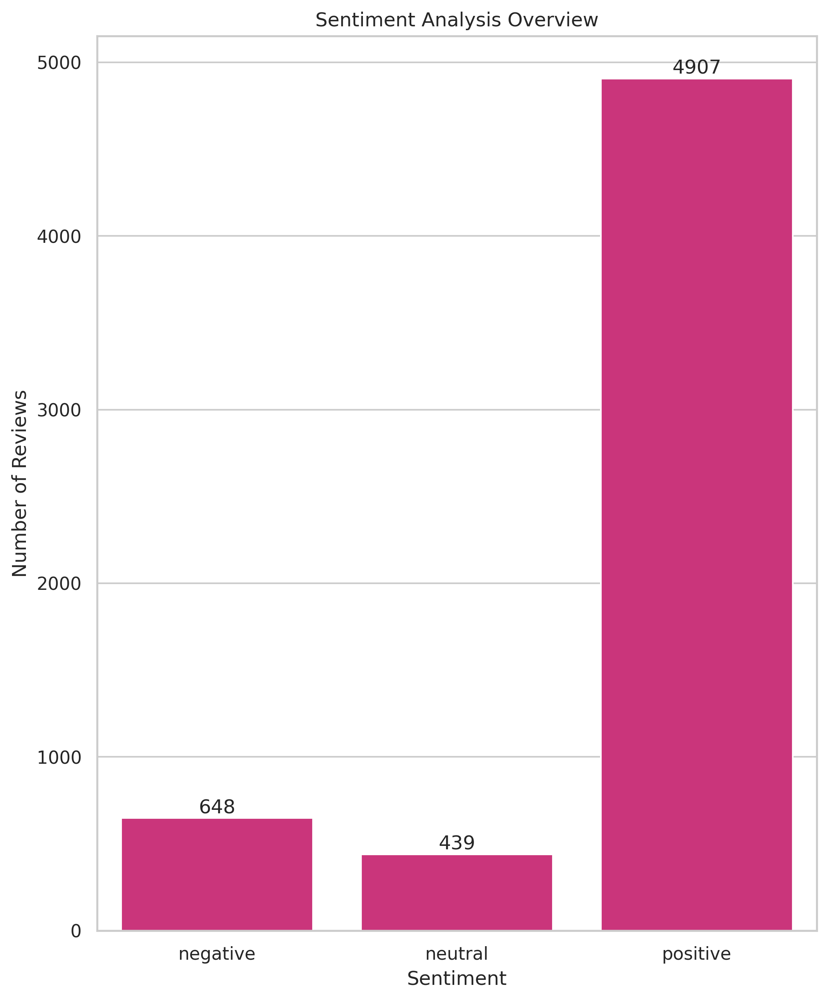
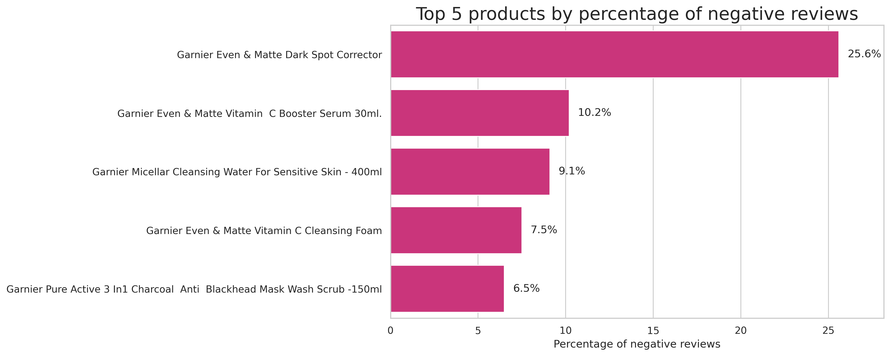

# **Sentiment Analysis and Topic Modelling of Garnier Product Reviews**
---

This analysis explores insights gained from sentiment analysis and topic
modeling conducted on verified customer reviews scraped using scrapy from the Official Garnier store on [jumia](https://www.jumia.co.ke/mlp-garnier-store/). By understanding the positive, neutral & negative sentiments, as well as the key themes emerging from customer feedback, Garnier can make informed decisions to enhance their product offerings to better meet the needs of their target audience.

## **Methodology**
---

### 1. **Natural Language Processing:**
- Leveraging advanced NLP techniques to analyze the language and
sentiment expressed in customer reviews.

### 2. **Quantitative  Analysis:**
- Measuring the prevalence of positive and negative sentiments to
identify key trends.

### 3. **Qualitative Analysis:**
- Examining the contextual nuances and customer perspectives
behind the sentiment data.
---

### **Top 5 products by overall number of reviews**

---

- #### **Number of reviews**
  - During this study, i've gathered 5,000+ reviews
across 54 products, covering a span of six years (from
May 2018 to July 2024).

- #### **Top 5 products:**

  1. Pure Active 3 In1 Charcoal -150ml
  2. Vitamin C Booster Serum 30ml
  3. Even & Matte Dark Spot Corrector
  4. Vitamin C Cleansing Foam
  5. Micellar Cleansing Water - 400ml

---

### **Sentiment Analysis Overview**

---

#### **Sentiment breakdown**
- The sentiment analysis for Garnier products reveals a predominantly
positive response, with 82% of reviews reflecting positive sentiment.
Negative sentiment accounts for 11%, while neutral sentiment
represents 7% of the total feedback.

---

### **Top 5 Garnier Products by percentage of Negative reviews**

---
#### **Summary:**
1. **Garnier Even & Matte Dark Spot Corrector** has the highest percentage of negative reviews among the top 5, at
25.8%, despite a relatively strong average rating of 4.0. It suggests that while the majority of users are satisfied, there is a significant portion of the customer base expressing dissatisfaction.

2. **Garnier Pure Active 3 In 1 Charcoal Anti-Blackhead** has the lowest percentage of negative reviews among the
top 5, at 6.5% with an average rating of 4.4, indicating that it is generally well-received by users
---

### **Topics in Garnier Even & Matte Dark Spot Corrector's Negative Review**

---

#### **Summary:**
The topic modelling of negative reviews for the Garnier Even & Matte Dark Spot Corrector reveals two key areas of customer dissatisfaction:

1. ##### **Ineffectiveness of the Dark Spot Corrector:**
   - **Topic Representation**: The most common complaint, with 54.5% mentions, revolves around the product
being ineffective. Customers express disappointment that the dark spot corrector does not deliver the
expected results, with key phrases like "doesnʼt work," "didnʼt work," and "ineffective."

   - **Sentiment:** This highlights a significant concern about the product's ability to meet its primary purpose of
correcting dark spots, leading to frustration among users.

2. ##### **Product Quantity Dissatisfaction:**
   - **Topic Representation:** The second most prevalent issue, with 45.5% of mentions pertains to dissatisfaction
with the product quantity. Customers feel that the tube or packaging is inadequate, often describing it as
"empty" , "little quantity & filled with air"

   - **Sentiment:** This suggests that users are not only concerned with the productʼs performance but also with
the perceived value for money, as they feel they are not getting enough product for the price they pay.

---

### **Implications for Product Development**
---

1. ####  **Strengthen Product Quality**

   - Conduct research and development to ensure consistently high quality formulations and address identified performance and effectiveness issues.

2. #### **Review and Adjust Packaging**
   - Conduct an evaluation of Garnier's Even & Matte Dark spot
corrector current packaging to ensure that it meets customer
expectations. If feasible increase product quantity without
significantly raising costs to enhance perceived value.

---

### **Conclusion and Recommendations**
---

1. #### **Actionable Insights**
   - ArtificiaI Intelligence through sentiment analysis and topic modeling
has uncovered valuable insights that can guide Garnier's product
development and marketing strategies.

2. #### **Competitive Advantage**
   - By addressing the key pain points, Garnier can differentiate itself in the market and strengthen its position as a trusted and innovative
brand.

